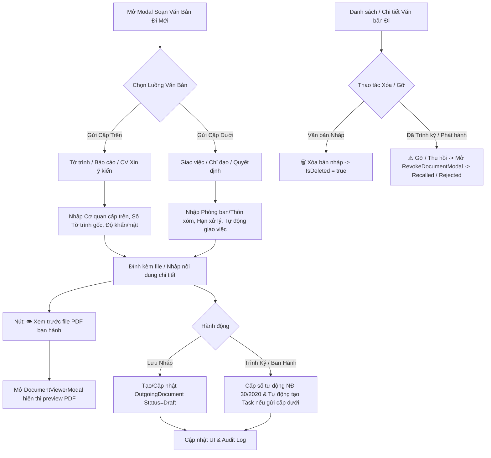

# Design Spec: Nâng Cấp Chi Tiết Soạn Thảo Văn Bản Đi & Tính Năng Xóa/Gỡ Văn Bản

## 1. Bối Cảnh & Mục Tiêu

Văn bản gửi đi trong bộ máy quản lý nhà nước xã Cát Ngạn có 2 bản chất nghiệp vụ rõ rệt:
1. **Gửi Cấp trên / Cơ quan quản lý (Tỉnh, Huyện, Sở)**: Gửi báo cáo tiến độ, tờ trình xin kinh phí/phê duyệt, công văn giải trình.
2. **Gửi Cấp dưới / Các Phòng ban / Thôn xóm**: Ban hành quyết định, thông báo, giao nhiệm vụ, chỉ đạo thực hiện.

Mục tiêu nâng cấp:
- **Làm chi tiết giao diện Soạn Văn Bản Đi Mới**: Phân tách 2 luồng rõ ràng, bổ sung đầy đủ thông tin hành chính NĐ 30/2020.
- **Tận dụng Trình xem PDF (PDF Viewer)**: Nút `[👁 Xem trước file PDF ban hành]` ngay từ trong modal soạn thảo.
- **Tự động Giao việc**: Khi gửi cấp dưới, tự động kích hoạt tạo Công việc vào Trung tâm Điều hành (`TaskItems`).
- **Chức năng Xóa / Gỡ Văn bản đi**: Cho phép Xóa nháp hoặc Gỡ/Thu hồi văn bản đã trình ký/phát hành kèm theo modal nhập lý do và ghi Sổ kiểm toán Audit Log.

---

## 2. Kiến Trúc & Luồng Dữ Liệu (Data & UI Flow)

---

## 3. Chi Tiết Thay Đổi

### A. Tầng Domain & Backend (C# .NET 8)
1. **Mở rộng `OutgoingDocument.cs`**:
   - `DestinationLevel`: `"Superior"` (Cấp trên) | `"Subordinate"` (Cấp dưới/Phòng ban).
   - `AutoCreateTask`: `bool` (Tự động giao việc vào Trung tâm điều hành).
   - `SecurityLevel`: `"Normal"` | `"Confidential"` | `"Secret"`.
   - `UrgencyLevel`: `"Normal"` | `"Urgent"` | `"VeryUrgent"` | `"Express"`.
   - `ResponseDeadline`: `DateTime?` (Hạn phản hồi / báo cáo).
2. **Commands**:
   - `CreateOutgoingDocumentCommand`: Bổ sung mapping `DestinationLevel`, `AutoCreateTask`, `SecurityLevel`, `UrgencyLevel`, `ResponseDeadline`.
   - Khi ban hành (`SignAndIssueOutgoingDocumentCommand`), nếu `AutoCreateTask = true` và `DestinationLevel == "Subordinate"`, hệ thống tự động khởi tạo 1 `TaskItem` trong Work Center với hạn xử lý = `ResponseDeadline`.
   - `CancelOutgoingDocumentCommand`: Xóa nháp hoặc Gỡ/Thu hồi văn bản ban hành.

### B. Tầng Frontend (Next.js / TypeScript)
1. **Soạn Văn Bản Đi Modal (`page.tsx`)**:
   - **Thanh chuyển Tab Luồng gửi**:
     - `📤 Gửi Cấp Trên (Báo cáo / Tờ trình)`
     - `📥 Gửi Cấp Dưới / Phòng ban / Thôn xóm`
   - **Các trường chi tiết bổ sung**:
     - Nơi nhận (Dropdown Cấp trên: UBND Huyện, Sở Nông nghiệp, Sở Tài chính... / Cấp dưới: Phòng Địa chính, Thôn Cát Ngạn...).
     - Ký hiệu văn bản (`UBND-VP`, `UBND-KT`...).
     - Độ khẩn & Độ mật.
     - Hạn xử lý / Phản hồi.
     - Checkbox: `[☑ Tự động tạo & giao việc vào Trung tâm điều hành]` (Kích hoạt sẵn khi gửi cấp dưới).
     - Nút **`[👁 Xem trước file PDF ban hành]`**: Mở ngay `DocumentViewerModal` để kiểm tra file PDF trước khi ban hành.
2. **Quản lý Xóa / Gỡ Văn bản Đi**:
   - Nút **`[🗑️ Xóa bản nháp]`** cho văn bản `Draft`.
   - Nút **`[⚠️ Gỡ / Thu hồi văn bản]`** cho văn bản `PendingSignature` / `Issued` / `Sent`.
   - Tích hợp `RevokeDocumentModal` nhập lý do gỡ/thu hồi và cập nhật UI tức thì.

---

## 4. Kế Hoạch Kiểm Thử (Verification Plan)

1. **Kiểm tra Biên dịch**:
   - Backend: `dotnet build Quanlycongviec.sln`
   - Frontend: `npx tsc --noEmit`
2. **Kiểm tra Migration CSDL**: `dotnet ef database update`
3. **Kiểm tra Giao diện Soạn thảo**:
   - Mở modal Soạn Văn Bản Đi Mới.
   - Chuyển giữa 2 tab Luồng gửi Cấp trên & Cấp dưới.
   - Bấm `[👁 Xem trước file PDF ban hành]` ➔ Verify hiển thị file PDF chuẩn hình thức.
   - Bấm `[Lưu & Trình Ký Duyệt]` với luồng gửi cấp dưới ➔ Verify tự động xuất hiện công việc trong Trung tâm điều hành.
4. **Kiểm tra Xóa / Gỡ Văn bản**:
   - Thử Xóa bản nháp.
   - Thử Gỡ / Thu hồi văn bản đã phát hành với lý do ➔ Verify văn bản chuyển trạng thái Thu hồi & Audit Log được lưu vết.
