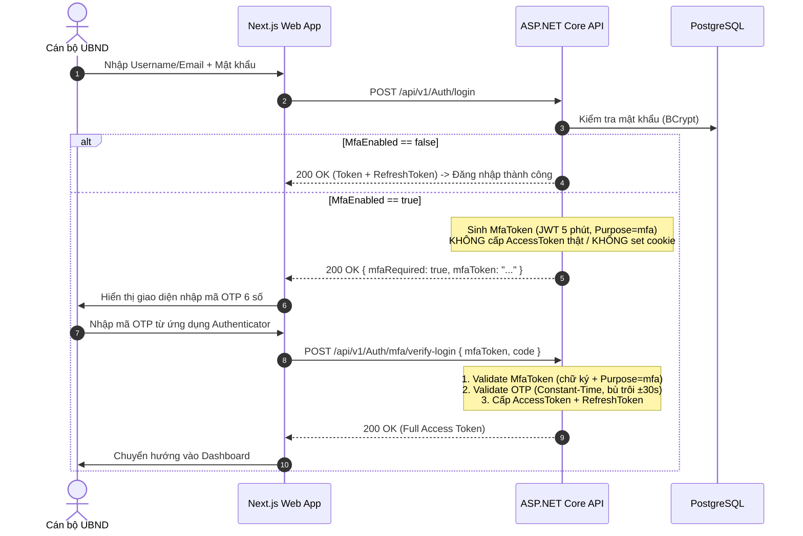

# Đặc Tả Tính Năng: Xác Thực Hai Yếu Tố (MFA/TOTP) & Đăng Nhập Hai Bước Bảo Vệ Tài Khoản Cán Bộ

> **Ngày ban hành:** 20/08/2026  
> **Trạng thái:** ✅ Đã hoàn thành và kiểm thử 100%  
> **Tiêu chuẩn kỹ thuật:** RFC 6238 (TOTP), RFC 4226 (HOTP Dynamic Truncation), NIST SP 800-63B (AAL2)  
> **Tương thích ứng dụng:** Google Authenticator, Microsoft Authenticator, Aegis, Ente Auth  

---

## 1. Bối Cảnh & Mục Tiêu

Hệ thống quản lý công việc UBND Xã Cát Ngạn quản lý các thông tin nhạy cảm về chỉ đạo, điều hành, giao việc, phân loại công văn và đánh giá năng lực cán bộ xã. Để bảo vệ tài khoản của lãnh đạo và công chức khỏi nguy cơ lộ lọt mật khẩu, truy cập trái phép từ xa qua mạng ngoài LAN, hệ thống triển khai cơ chế **Xác thực 2 yếu tố (2-Factor Authentication - MFA)** dựa trên chuẩn **TOTP (Time-based One-Time Password)**.

### Mục tiêu cốt lõi:
1. **Không phụ thuộc dịch vụ bên thứ ba (Zero Third-Party Dependency / 0đ chi phí):** Tự triển khai thuật toán HMAC-SHA1 + Base32 trực tiếp trong tầng Application.
2. **Bảo vệ nhiều lớp (Multi-layer Defense):** Chống tấn công Timing Attack (Constant-Time Comparison), chống Bruteforce (Rate Limiting 5 lần/phút/IP), chống leo thang đặc quyền qua Interim Token (`OnTokenValidated`).
3. **Trải nghiệm mượt mà:** Giao diện hỗ trợ cả quét mã QR lẫn nhập khoá bí mật thủ công (Base32) và phân bước xác thực rõ ràng trên Next.js Dashboard.

---

## 2. Kiến Trúc Kỹ Thuật (Architecture & Flow)

### 2.1. Sơ đồ luồng Đăng nhập 2 bước (2-Step Verification Flow)

---

## 3. Các Biện Pháp Phòng Vệ Bảo Mật Chuyên Sâu

| STT | Lỗ Hổng / Nguy Cơ Tiềm Ẩn | Cơ Chế Phòng Vệ Đã Triển Khai |
|:---:|---|---|
| **1** | **Interim Token Privilege Escalation** (Dùng `MfaToken` tạm để gọi API có `[Authorize]`) | Bổ sung `OnTokenValidated` trong `JwtBearerEvents`: Từ chối ngay lập tức mọi JWT mang claim `Purpose == "mfa"`. `MfaToken` chỉ có hiệu lực duy nhất tại endpoint `/Auth/mfa/verify-login`. |
| **2** | **Timing Attack** (Tấn công kênh kề đo thời gian phản hồi so khớp mã số) | Sử dụng hàm `CryptographicOperations.FixedTimeEquals` so sánh mảng byte UTF-8 của mã 6 chữ số zero-padded (`D6`), đảm bảo thời gian so khớp bất biến. |
| **3** | **OTP Brute-Force & DoS** (Dò mã 6 chữ số: 1.000.000 khả năng) | Áp dụng `[EnableRateLimiting("LoginLimiter")]` trên toàn bộ các endpoint `/mfa/setup`, `/mfa/enable`, `/mfa/disable`, `/mfa/verify-login` (giới hạn theo IP). |
| **4** | **Rò rỉ Secret qua JSON / Log** | Đánh dấu thuộc tính `[System.Text.Json.Serialization.JsonIgnore]` trên trường `MfaSecret` của Entity `User`. |
| **5** | **Bù trôi đồng hồ thiết bị (Clock Skew)** | Cho phép dung sai $\pm 1$ bước (30 giây) để cán bộ không bị từ chối khi đồng hồ điện thoại chênh lệch nhẹ với máy chủ. |

---

## 4. Danh Sách Endpoint Backend

| Phương thức | Endpoint | Yêu cầu Auth | Rate Limit | Mục đích |
|---|---|:---:|:---:|---|
| `POST` | `/api/v1/Auth/login` | Anonymous | ✅ LoginLimiter | Kiểm tra mật khẩu; nếu tài khoản bật MFA thì trả về `mfaRequired: true` và `mfaToken`. |
| `POST` | `/api/v1/Auth/mfa/verify-login` | Anonymous | ✅ LoginLimiter | Gửi `mfaToken` + mã OTP 6 số để nhận `AccessToken` và `RefreshToken`. |
| `POST` | `/api/v1/Auth/mfa/setup` | Bearer Token | ✅ LoginLimiter | Sinh khoá bí mật Base32 ngẫu nhiên (32 bytes = 256 bits) và URI `otpauth://`. |
| `POST` | `/api/v1/Auth/mfa/enable` | Bearer Token | ✅ LoginLimiter | Xác nhận mã OTP đầu tiên hợp lệ trước khi kích hoạt `MfaEnabled = true`. |
| `POST` | `/api/v1/Auth/mfa/disable` | Bearer Token | ✅ LoginLimiter | Yêu cầu nhập đúng mã OTP hiện tại để tắt MFA và xóa `MfaSecret`. |
| `GET` | `/api/v1/Auth/me` | Bearer Token | — | Trả về thông tin phiên đăng nhập kèm trạng thái `mfaEnabled` thời gian thực từ DB. |

---

## 5. Kết Quả Kiểm Thử (Verification Evidence)

1. **Bộ kiểm thử Unit Test Backend (`dotnet test`)**:
   - `TotpServiceTests.cs`: 6 test cases (Entropy Base32, định dạng URI, xác thực đúng giờ, dung sai $\pm 1$ step, từ chối mã hết hạn, từ chối dữ liệu rác).
   - `MfaCommandHandlerTests.cs`: 6 test cases (Setup, Enable thành công/thất bại, Verify login thành công/thất bại, Disable thành công).
   - **Tổng cộng**: **117/117 Test Cases ĐẠT 100%** (113 Application Tests + 4 API Integration Tests).
2. **Biên dịch Frontend (`npm run build`)**:
   - Next.js 14 biên dịch thành công 100% không phát sinh lỗi TypeScript.
